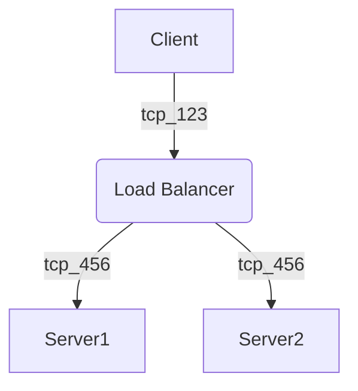

# div 表示

<div class="mermaid">
graph TD
  A[Client] --> B[Load Balancer] 
  B --> C[Server1] 
  B --> D[Server2]
</div>
<script src="https://cdn.jsdelivr.net/npm/mermaid@8.13.10/dist/mermaid.min.js"></script>
<script>
mermaid.initialize({ startOnLoad: true });
</script>

## 方法

ブログ記事(markdown)に直接以下を書いた

```html
<div class="mermaid">
graph TD
  A[Client] --> B[Load Balancer] 
  B --> C[Server1] 
  B --> D[Server2]
</div>
<script src="https://cdn.jsdelivr.net/npm/mermaid@8.13.10/dist/mermaid.min.js"></script>
<script>
mermaid.initialize({ startOnLoad: true });
</script>
```

# md 表示

````mermaid 〜 ```` でも表示できた。



こっちの方が `|` が中で使えた。でもデフォルトの色が見にくいかも。
